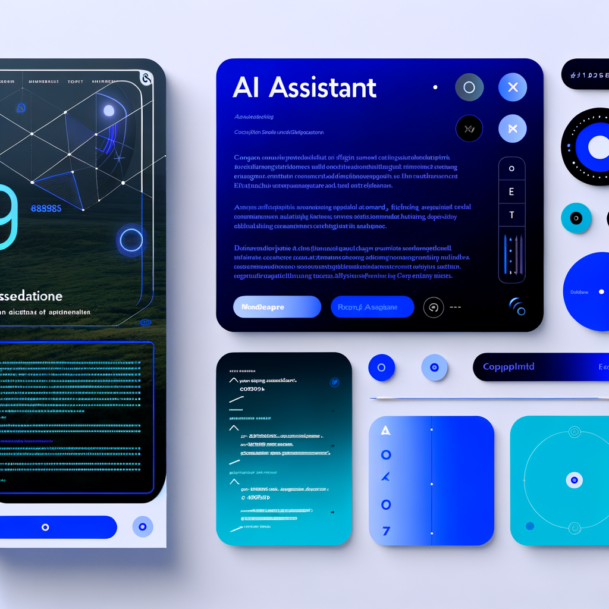
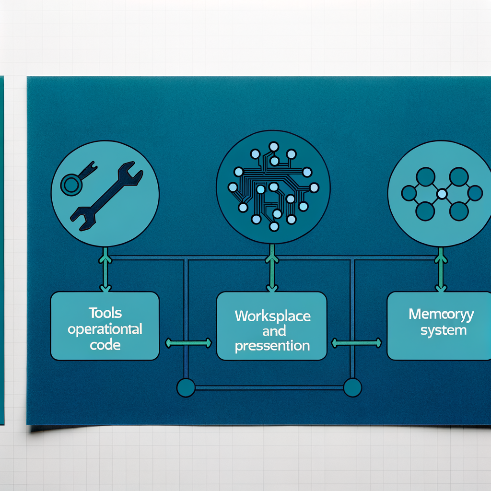

# Jarvis: Your Comprehensive AI Assistant

## The Vision of Jarvis

Jarvis transcends traditional AI assistants by becoming your versatile partner across multiple domains. More than just a coding assistant, Jarvis helps you develop applications, generate content, create images, manage information, and accomplish a wide range of tasks. The system establishes a collaborative relationship between human creativity and AI capabilities, adapting to your workflow and actively contributing to solving complex problems.

## How Jarvis Works

At its core, Jarvis combines cutting-edge language models with specialized tools and services. When you describe a need, Jarvis engages in a dialogue to clarify requirements, suggests approaches, and iteratively refines solutions. The project structure facilitates this partnership with dedicated spaces for tools (operational code), workspace (planning and presentation), and shared memory (persistent knowledge). This creates a continuous feedback loop where both human insight and AI capabilities are maximized.

## Beyond Traditional Assistance

The true power of Jarvis emerges when we approach it as a comprehensive partner rather than a single-purpose tool. Jarvis can:

- Develop software through collaborative dialogue
- Generate images and visual content
- Organize information and maintain memory across sessions  
- Create and manage content for various platforms
- Execute complex workflows by leveraging specialized tools

This versatility allows humans to focus on creative direction and decision-making while Jarvis handles implementation details, pattern recognition, and maintaining consistency across projects.

## Getting Started with Jarvis

Ready to experience enhanced productivity? Here's how to start your journey with Jarvis:

1. Clone the repository and set up your environment
2. Configure your API keys in the tools/config directory
3. Explore the project structure to understand the operational model
4. Create your first ticket and watch as Jarvis helps transform it into reality

Join us in exploring what's possible when human creativity meets versatile AI assistance! 