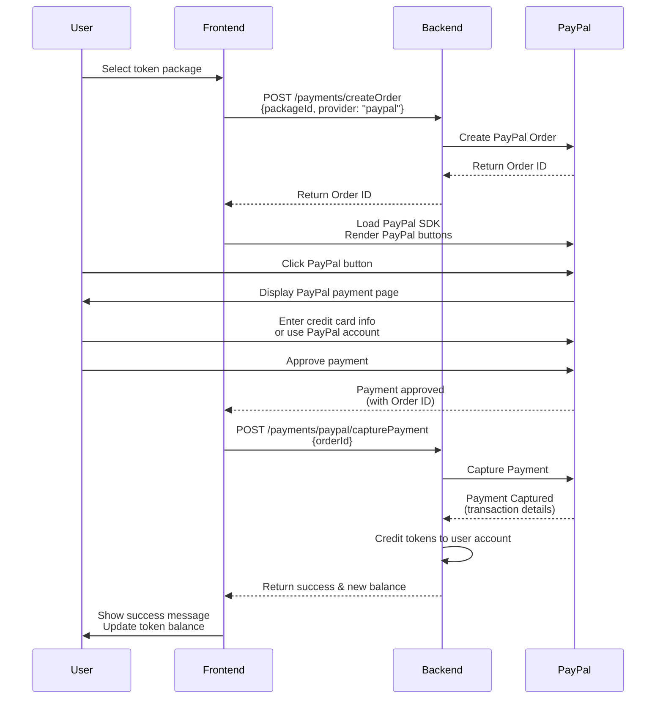

# PayPal Payment Flow Diagram

## Overview

This document explains the complete flow of a PayPal payment integration, showing how the frontend, backend, and PayPal services interact during the payment process. A key benefit of this integration is that users enter their credit card information directly on PayPal's secure pages, not on our application.

## Payment Flow Diagram



## Credit Card Information Handling

**Important**: Our application never handles, processes, or stores credit card information. This is a critical security and compliance benefit of using PayPal.

1. **User enters credit card information on PayPal's site**:
   - When the user clicks the PayPal button, they are directed to PayPal's secure environment
   - The user can either log in to their PayPal account or choose to pay with a credit card without creating an account
   - All credit card details are entered directly on PayPal's pages, which are PCI-DSS compliant
   - Our application never sees, processes, or stores the credit card numbers, CVV codes, or expiration dates

2. **Security benefits**:
   - Reduced PCI compliance scope for our application
   - PayPal's robust security infrastructure protects sensitive payment data
   - Users may feel more comfortable entering payment details on a recognized payment platform
   - Our application is not responsible for storing or securing credit card information

3. **User experience**:
   - Users can pay with their existing PayPal account if they have one
   - Users without a PayPal account can still pay with a credit card as a guest
   - The PayPal interface can be presented as a popup or redirect, depending on implementation
   - After payment is complete, the user is returned to our application

## Detailed Flow Explanation

### Step 1: Create Order

1. **User selects a token package** in the frontend application
2. **Frontend sends request to backend** with the package ID and specifies "paypal" as the provider
   ```
   POST /api/payments/createOrder
   {
     "packageId": "standard",
     "provider": "paypal"
   }
   ```
3. **Backend creates a PayPal order** using the PayPal SDK
   - The backend calculates the price based on the package
   - It calls PayPal's API to create an order with the amount and description
4. **PayPal returns an order ID** to the backend
5. **Backend returns the order ID** to the frontend
   ```
   {
     "orderId": "5O190127TN364715T"
   }
   ```

### Step 2: Approve Payment

6. **Frontend loads the PayPal JavaScript SDK** and renders the PayPal buttons
   - The SDK is loaded directly from PayPal's servers
   - The buttons are rendered in a container on the page
7. **User clicks the PayPal button** which opens a PayPal-hosted popup or redirects to PayPal
8. **User enters payment information on PayPal's site**:
   - They can log in to their PayPal account
   - Or they can enter credit card details directly on PayPal's page
   - PayPal handles all the payment information securely
9. **User approves the payment** on PayPal's interface
   - This happens entirely on PayPal's side
   - The user never enters payment details on our site

### Step 3: Capture Payment

10. **PayPal notifies the frontend** that the payment was approved
    - This happens via a callback function provided to the PayPal SDK
    - The order ID is included in the response
11. **Frontend sends capture request to backend** with the order ID
    ```
    POST /api/payments/paypal/capturePayment
    {
      "orderId": "5O190127TN364715T"
    }
    ```
12. **Backend captures the payment** by calling PayPal's API
13. **PayPal confirms the capture** and returns transaction details

### Step 4: Complete Transaction

14. **Backend processes the successful payment**:
    - Updates the payment record in the database
    - Credits tokens to the user's account
    - Records the transaction
15. **Backend returns success response** to the frontend with the new token balance
    ```
    {
      "success": true,
      "transactionId": "8MC585209K746392H",
      "newBalance": 425
    }
    ```
16. **Frontend shows success message** and updates the displayed token balance

## Important Notes

1. **The user never enters payment details on our site**
   - All payment information is handled securely by PayPal
   - This reduces our PCI compliance requirements

2. **The backend is responsible for**:
   - Creating the initial order
   - Capturing the payment after approval
   - Crediting tokens to the user's account
   - Maintaining payment records

3. **The frontend is responsible for**:
   - Initiating the payment process
   - Loading the PayPal SDK
   - Rendering the PayPal buttons
   - Handling the approval callback
   - Requesting payment capture
   - Updating the UI with the result

4. **PayPal handles**:
   - User authentication
   - Payment method selection
   - Credit card information collection and processing
   - Payment processing
   - Security of payment details

## Implementation Requirements

### Backend Requirements

- PayPal SDK installed
- Environment variables for PayPal credentials
- API endpoints for creating orders and capturing payments
- Service for interacting with PayPal API
- Database storage for payment records

### Frontend Requirements

- Ability to load the PayPal JavaScript SDK
- Container for rendering PayPal buttons
- Callbacks for handling payment approval and cancellation
- API calls to backend for order creation and payment capture 