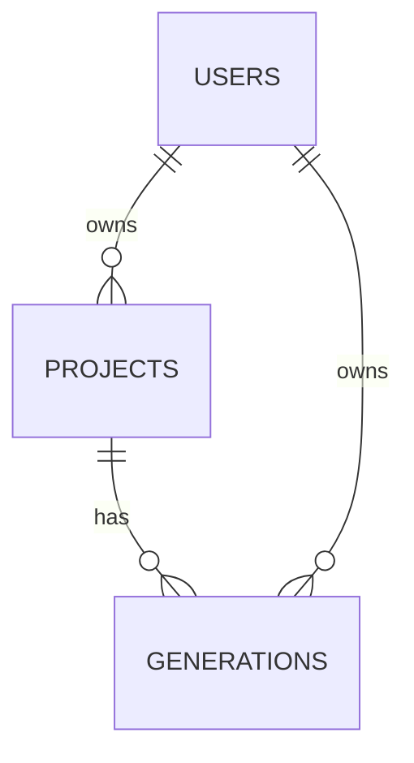
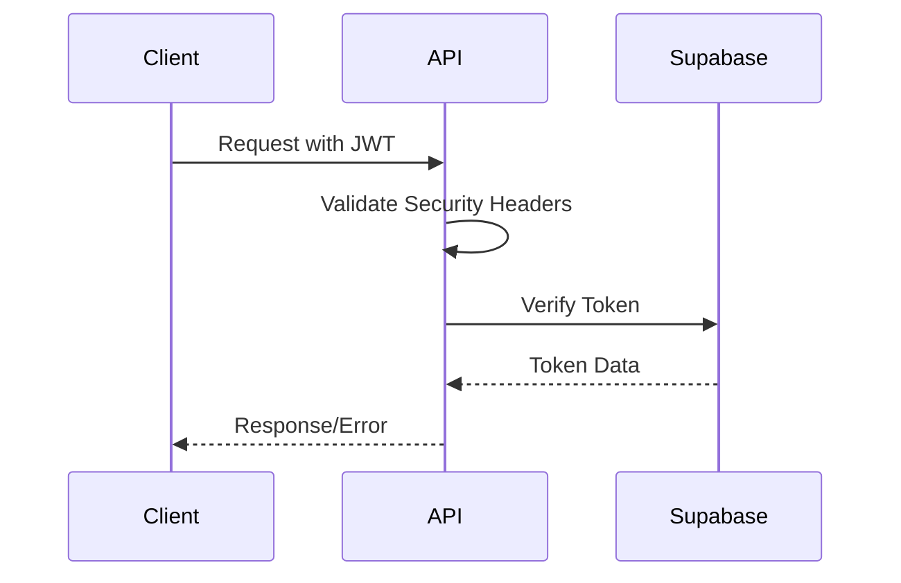

# 🏗️ Video Generation Backend Architecture
> Version 1.1

## 📋 Contents
1. [Overview](#overview)
2. [Core Architecture](#core-architecture-decisions)
3. [System Components](#system-components)
4. [Database Schema](#database-schema)
5. [Security Architecture](#security-architecture)
6. [Configuration](#configuration)
7. [Integration](#integration-points)

---

## 🎯 Overview
A Node.js backend service leveraging Supabase for authentication and data persistence, deployed on Replit. The architecture emphasizes scalability, maintainability, and security.

> 📚 For detailed project structure information, see [02_PROJECT_STRUCTURE.md](./02_PROJECT_STRUCTURE.md)  
> 📚 For implementation standards, see [02_IMPLEMENTATION_STANDARDS.md](./02_IMPLEMENTATION_STANDARDS.md)  
> 📚 For services architecture, see [03_SERVICES_ARCHITECTURE.md](./03_SERVICES_ARCHITECTURE.md)

---

## 🏛️ Core Architecture Decisions

### 🔧 Service Architecture
- **Layered Architecture**: Clear separation between API, business logic, and data access layers
- **Modular Design**: Independent modules for different service capabilities
- **Stateless Design**: No session storage, facilitating horizontal scaling
- **Replit Integration**: Utilizing Replit's Node.js environment and deployment capabilities
- **Repository Pattern**: Separation of data access logic from business logic
- **Dependency Injection**: Using tsyringe for service dependencies

### 💻 Technology Choices
- **Runtime**: Node.js with Express on Replit
- **Authentication**: Supabase Authentication
- **Database**: Supabase PostgreSQL
- **Development Environment**: Replit
- **Production Hosting**: Replit
- **Dependency Injection**: tsyringe
- **Logging**: Winston

### ⚙️ Replit-Specific Configuration
- **.replit file**: Defines run commands and language
- **replit.nix**: Manages system-level dependencies
- **Secrets**: Environment variables stored in Replit Secrets panel

---

## 🔄 System Components

### 🔐 Authentication Layer
- Supabase-based authentication
- Stateless authentication using Supabase JWT
- Middleware chain for request validation:
  1. Security headers
  2. Token validation
  3. Error handling

### 📊 Database Management
- All database migrations are handled directly in Supabase
- No local migration scripts
- Schema changes must be made through Supabase dashboard
- Row Level Security (RLS) policies configured in Supabase

### 🔄 Core Services

The system is organized around four core services:

#### 1. Project Management Service
- **Core Functionality**:
  - Project management and retrieval
  - Video generation tracking
  - User-specific project access
- **Implementation**: `ProjectService`
- **Location**: `src/services/project/service.ts`

#### 2. Video Generation Service
- **Core Functionality**:
  - Video generation request handling
  - Generation status tracking
  - Integration with Runway API
- **Implementation**: `VideoGenerationService`
- **Location**: `src/services/video/service.ts`

#### 3. Image Management Service
- **Core Functionality**:
  - Image upload handling
  - Image validation
  - Image storage management
- **Implementation**: `ImageService`
- **Location**: `src/services/image/service.ts`

#### 4. Prompt Management Service
- **Core Functionality**:
  - Prompt component management
  - Prompt categorization
- **Implementation**: `PromptService`
- **Location**: `src/services/prompt/service.ts`

### 📁 Supporting Services

#### 1. Validation Services
- **Image Validation Service**:
  - Validates uploaded images
  - Ensures format and size compliance
  - **Implementation**: `ImageValidationService`
  - **Location**: `src/services/image/validation/service.ts`

#### 2. Storage Services
- **Storage Service**:
  - Handles file storage operations
  - Manages file lifecycle
  - **Implementation**: `ImageStorageService`
  - **Location**: `src/services/image/storage/service.ts`

#### 3. Monitoring Service
- **Core Functionality**:
  - Resource usage monitoring
  - Performance metrics tracking
  - Alert threshold management
  - **Implementation**: `MonitoringService`
  - **Location**: `src/services/core/monitoring/service.ts`

### 🗄️ Storage Integration
- **Supabase Storage**:
  - Bucket management
  - Access policies
  - URL generation
  - Lifecycle management

---

## 📝 Database Schema

### Tables Structure
```sql
-- Projects Table
CREATE TABLE projects (
  id UUID PRIMARY KEY DEFAULT uuid_generate_v4(),
  user_id UUID NOT NULL REFERENCES auth.users(id),
  image_url TEXT NOT NULL,
  prompt TEXT NOT NULL,
  title TEXT,
  created_at TIMESTAMPTZ DEFAULT NOW(),
  updated_at TIMESTAMPTZ DEFAULT NOW()
);

-- Generations Table
CREATE TABLE generations (
  id UUID PRIMARY KEY DEFAULT uuid_generate_v4(),
  project_id UUID NOT NULL REFERENCES projects(id),
  user_id UUID NOT NULL REFERENCES auth.users(id),
  prompt TEXT NOT NULL,
  status TEXT NOT NULL,
  video_url TEXT,
  error_message TEXT,
  model_id TEXT,
  duration INTEGER,
  thumbnail_url TEXT,
  started_at TIMESTAMPTZ,
  completed_at TIMESTAMPTZ,
  created_at TIMESTAMPTZ DEFAULT NOW(),
  updated_at TIMESTAMPTZ DEFAULT NOW(),
  metadata JSONB DEFAULT '{}'::jsonb
);
```

### 🔒 RLS Policies
```sql
-- Projects RLS
ALTER TABLE projects ENABLE ROW LEVEL SECURITY;

CREATE POLICY "Users can view own projects"
  ON projects FOR SELECT
  USING (auth.uid() = user_id);

-- Generations RLS
ALTER TABLE generations ENABLE ROW LEVEL SECURITY;

CREATE POLICY "Users can view own generations"
  ON generations FOR SELECT
  USING (auth.uid() = user_id);
```

### 🔗 Relationships


---

## 🔐 Security Architecture

### Authentication Flow


### 🛡️ Security Measures
- **Token Management**:
  - JWT validation through Supabase
  - Secure token handling
- **Request Protection**:
  - CORS configuration
  - Helmet security headers
- **Data Protection**:
  - Row Level Security (RLS)
  - Input validation
  - Request sanitization
  - Secure error responses

---

## ⚙️ Configuration

### 🌐 Base Configuration
```markdown
📡 Base URL: https://video-gen-back-end.replit.app
🔑 Authentication: Bearer Token via Supabase JWT
```

### 🔐 Replit Secrets Management
- All sensitive configuration is stored in Replit Secrets
- Secrets are encrypted and only accessible within the Replit environment
- No sensitive values are stored in code or version control

### Required Secrets
```markdown
# Required Secrets in Replit
SUPABASE_URL             # Supabase project URL
SUPABASE_ANON_KEY        # Supabase anonymous client key
SUPABASE_SERVICE_ROLE_KEY # Supabase service role key for admin operations
RUNWAY_API_KEY           # Runway API key for video generation
```

### Environment Variables
```env
# Runtime configuration (non-sensitive)
PORT=3000
NODE_ENV=production
```

### 🔄 Configuration Loading
```typescript
// Configuration is validated at startup
if (!process.env.SUPABASE_URL || !process.env.SUPABASE_ANON_KEY) {
  throw new Error('Missing required Supabase configuration');
}
```

### 🛠️ Development Setup
1. All sensitive values must be configured in Replit Secrets
2. Environment-specific values are loaded from appropriate sources
3. Configuration is validated at application startup
4. Secrets are never logged or exposed in responses

### 🔒 Security Headers
All responses include:
- Content Security Policy (CSP)
- CORS headers
- XSS Protection
- HSTS
- Frame protection

---

## 🔌 Integration Points

### 🌐 External Services
- **Supabase**:
  - Authentication service
  - Database with RLS
  - User management
  - Storage buckets
- **Runway**:
  - Video generation API
  - Model selection
  - Generation status tracking

### 🔗 Client Integration
- API documentation in [03_API.md](./03_API.md)
- Testing guidelines in [05_TESTING.md](./05_TESTING.md)

---

> 📘 This architecture document provides a high-level overview of the system design. For specific implementation details, refer to the linked documentation files.
