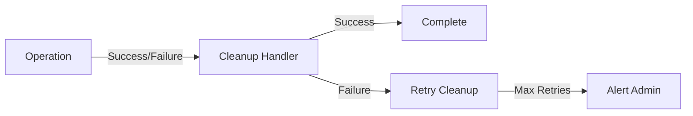

# 🛠️ Implementation Standards
> Version 1.0

## 📋 Contents
1. [Service Standards](#service-standards)
2. [Service Pattern Standards](#service-pattern-standards)
3. [Error Handling Strategy](#error-handling-strategy)
4. [Monitoring and Logging](#monitoring-and-logging)
5. [Operational Architecture](#operational-architecture)
6. [Resource Management](#resource-management)
7. [Transaction Management](#transaction-management)
8. [Enhanced Monitoring](#enhanced-monitoring)

---

## 🔨 Service Standards

### Route Responsibilities
Routes should ONLY:
- Receive HTTP requests
- Validate request format
- Call appropriate service method
- Send HTTP responses
- Handle HTTP-level errors

### Service Responsibilities
Services should handle ALL:
- Business logic implementation
- Data validation and processing
- Database operations and transactions
- Domain-specific error handling
- Operation logging and monitoring
- State management and transitions

### Implementation Pattern
```typescript
// service.ts
@injectable()
export class FeatureService {
  constructor(private dependencies: Dependencies) {}
  
  async performOperation(): Promise<Result> {
    logger.info('Starting operation');
    // Validation
    // Business Logic
    // Database Operations
    // Error Handling
  }
}

// routes.ts
router.post('/', async (req, res) => {
  try {
    const result = await featureService.performOperation(req.body);
    res.json(result);
  } catch (error) {
    handleError(error, res);
  }
});
```

### Base Service Pattern
All services should extend the BaseService class which provides:
- Common utility methods
- Standardized logging
- Error handling helpers
- Dependency management

```typescript
@injectable()
export abstract class BaseService {
  protected logger: Logger;
  
  constructor() {
    this.logger = logger;
  }
  
  protected handleError(error: Error, context: string): never {
    this.logger.error(`Error in ${context}`, { error });
    throw this.mapToAppError(error);
  }
  
  protected mapToAppError(error: Error): AppError {
    // Map to appropriate AppError type
  }
}
```

### ServiceResult Pattern
Services should return a standardized ServiceResult object:

```typescript
interface ServiceResult<T> {
  success: boolean;
  data?: T;
  error?: AppError;
  metadata?: Record<string, unknown>;
}
```

### Working Examples
1. **Image Upload Service**
   - Clean separation of concerns
   - Proper error handling
   - Consistent logging
   - Type safety

2. **Project Service**
   - Following established patterns
   - Maintaining consistency
   - Using repository pattern

---

## 📦 Service Pattern Standards

### Core Principles
1. **Clear Separation of Concerns**
   - Routes handle HTTP only
   - Services handle business logic
   - Each piece has one job

2. **Standard Service Structure**
   ```
   src/
   ├── services/
   │   └── feature/
   │       ├── service.ts         # Business logic
   │       ├── repository.ts      # Data access
   │       ├── types.ts           # Types
   │       └── errors.ts          # Service-specific errors
   ├── routes/
   │   └── feature.routes.ts      # HTTP handling only
   └── types/
       └── feature.ts             # Shared types
   ```

### Routes Should ONLY:
- Accept HTTP requests
- Call appropriate service method
- Handle HTTP responses
- Pass errors to error handlers

### Services Should Handle ALL:
- Business logic
- Data validation
- Database operations
- Error handling
- Logging
- State management

### Example Pattern:
```typescript
// feature/service.ts
@injectable()
export class FeatureService extends BaseService {
  constructor(
    @inject(TYPES.FeatureRepository) private repository: FeatureRepository
  ) {
    super();
  }
  
  async performOperation(): Promise<ServiceResult<Result>> {
    this.logger.info('Starting operation');
    try {
      // Validation
      // Business Logic
      const data = await this.repository.getData();
      // Processing
      return { success: true, data };
    } catch (error) {
      return this.handleServiceError(error, 'performOperation');
    }
  }
}

// feature.routes.ts
router.post('/', async (req, res) => {
  try {
    const result = await featureService.performOperation(req.body);
    if (!result.success) {
      return handleError(result.error, res);
    }
    res.json(result.data);
  } catch (error) {
    handleError(error, res);
  }
});
```

### Repository Pattern
Data access should be isolated in repository classes:

```typescript
@injectable()
export class FeatureRepository {
  constructor(
    @inject(TYPES.Database) private db: Database
  ) {}
  
  async getData(): Promise<Data[]> {
    // Database operations
  }
  
  async saveData(data: Data): Promise<Data> {
    // Database operations
  }
}
```

### Error Handling Standards:
1. Services throw typed errors
2. Routes catch and translate to HTTP
3. Consistent error format:
   ```typescript
   {
     code: ErrorCode;
     message: string;
     details?: Record<string, unknown>;
   }
   ```

### Logging Standards:
1. Services log operations:
   - Start of operations
   - Key state changes
   - Errors with context
2. Routes log:
   - Request receipt
   - Response status

### Testing Standards:
1. Services: Unit tests for business logic
2. Routes: Integration tests for HTTP
3. Types: Type checking
4. Error cases covered

This pattern ensures:
- Maintainable code
- Clear responsibilities
- Consistent structure
- Easy debugging
- Scalable architecture

---

## ⚠️ Error Handling Strategy

### Error Hierarchy
```typescript
class AppError extends Error {
  constructor(
    public readonly status: HttpStatus,
    public readonly code: ErrorCode,
    message: string,
    public readonly severity: ErrorSeverity,
    public readonly details?: Record<string, unknown>
  ) {
    super(message);
  }
}
```

### Error Categories
```typescript
enum ErrorCode {
  // Auth Errors
  INVALID_CREDENTIALS = 'auth/invalid-credentials',
  TOKEN_EXPIRED = 'auth/token-expired',
  
  // Validation Errors
  INVALID_INPUT = 'validation/invalid-input',
  
  // System Errors
  SERVER_ERROR = 'system/server-error',
  CONNECTION_ERROR = 'system/connection-error'
}
```

### Error Handling Flow
1. **Service Layer**:
   - Catch specific errors
   - Map to AppError types
   - Include context and details
   - Log with appropriate severity

2. **Route Layer**:
   - Catch AppErrors
   - Map to HTTP responses
   - Sanitize sensitive information
   - Log request failure

3. **Global Error Handler**:
   - Catch uncaught errors
   - Map to generic server error
   - Log with stack trace
   - Return safe response

---

## 📊 Monitoring and Logging

### 📝 Logging Implementation
- **Winston Logger**:
  - Error logging
  - Combined logging
  - Request sanitization
  - Performance metrics

### Log Levels
```typescript
enum LogLevel {
  ERROR = 'error',
  WARN = 'warn',
  INFO = 'info',
  DEBUG = 'debug'
}
```

### Standard Log Format
```typescript
interface LogEntry {
  level: LogLevel;
  message: string;
  timestamp: string;
  context?: string;
  userId?: string;
  requestId?: string;
  details?: Record<string, unknown>;
}
```

### 📈 Performance Tracking
- Error handling duration
- Service method timing
- Query performance monitoring
- RLS policy impact tracking

### Resource Monitoring
- Memory usage tracking
- CPU utilization
- Storage operations
- Network requests

---

## 🔧 Operational Architecture

### Retry Mechanisms
```typescript
interface RetryStrategy {
  maxAttempts: number;
  backoffMs: number;
  shouldRetry(error: Error): boolean;
  onRetry(attempt: number, error: Error): void;
}

interface OperationResult<T> {
  success: boolean;
  data?: T;
  error?: Error;
  attempts: number;
}
```

### Retry Implementation
```typescript
async function withRetry<T>(
  operation: () => Promise<T>,
  strategy: RetryStrategy
): Promise<OperationResult<T>> {
  let attempts = 0;
  let lastError: Error | undefined;
  
  while (attempts < strategy.maxAttempts) {
    try {
      attempts++;
      const data = await operation();
      return { success: true, data, attempts };
    } catch (error) {
      lastError = error as Error;
      
      if (!strategy.shouldRetry(lastError) || attempts >= strategy.maxAttempts) {
        break;
      }
      
      strategy.onRetry(attempts, lastError);
      await new Promise(resolve => setTimeout(resolve, strategy.backoffMs * attempts));
    }
  }
  
  return { success: false, error: lastError, attempts };
}
```

---

## 📦 Resource Management

### Cleanup Procedures


### Resource Limits
- **File Uploads**:
  - File size: 10MB per upload
  - Storage quota: Based on user tier
  - Concurrent uploads: 3 per user
  - Processing time: 30s timeout

- **API Limits**:
  - Rate limiting: 60 requests/minute
  - Burst allowance: 10 requests/second
  - Payload size: 50MB maximum
  - Response time: 30s timeout

### Resource Cleanup
```typescript
interface CleanupHandler {
  register(resource: Resource): void;
  cleanup(resource: Resource): Promise<void>;
  onFailure(resource: Resource, error: Error): Promise<void>;
}
```

---

## 🔄 Transaction Management

### Transaction Interface
```typescript
interface TransactionManager {
  begin(): Promise<void>;
  commit(): Promise<void>;
  rollback(): Promise<void>;
  onRollback(handler: () => Promise<void>): void;
}
```

### Transaction Implementation
```typescript
class SupabaseTransactionManager implements TransactionManager {
  private client: SupabaseClient;
  private rollbackHandlers: Array<() => Promise<void>> = [];
  
  constructor(client: SupabaseClient) {
    this.client = client;
  }
  
  async begin(): Promise<void> {
    await this.client.rpc('begin_transaction');
  }
  
  async commit(): Promise<void> {
    await this.client.rpc('commit_transaction');
  }
  
  async rollback(): Promise<void> {
    await this.client.rpc('rollback_transaction');
    
    // Execute rollback handlers
    for (const handler of this.rollbackHandlers) {
      try {
        await handler();
      } catch (error) {
        logger.error('Error in rollback handler', { error });
      }
    }
  }
  
  onRollback(handler: () => Promise<void>): void {
    this.rollbackHandlers.push(handler);
  }
}
```

---

## 📊 Enhanced Monitoring

### Performance Metrics
- **Upload Pipeline**:
  - Validation time: < 100ms
  - Storage operation: < 1s
  - Total processing: < 3s
  - Success rate: > 99%

- **Resource Usage**:
  - Memory per operation: < 50MB
  - CPU utilization: < 80%
  - Storage IOPS: < 100/s
  - Network bandwidth: < 50Mbps

### Alert Thresholds
```typescript
interface AlertThreshold {
  metric: string;
  warning: number;
  critical: number;
  duration: string;
  action: 'notify' | 'throttle' | 'shutdown';
}

const thresholds: AlertThreshold[] = [
  {
    metric: 'error_rate',
    warning: 0.05,  // 5%
    critical: 0.10, // 10%
    duration: '5m',
    action: 'notify'
  },
  {
    metric: 'response_time',
    warning: 2000,  // 2s
    critical: 5000, // 5s
    duration: '1m',
    action: 'throttle'
  }
];
```

### Health Checks
- **Components**:
  - Storage connectivity
  - Database connections
  - Memory usage
  - File system status

- **Recovery Actions**:
  ```mermaid
  flowchart TD
    Check[Health Check] --> |Failed| Retry[Retry]
    Retry --> |Success| Normal[Resume]
    Retry --> |Failure| Fallback[Use Fallback]
    Fallback --> |Success| Normal
    Fallback --> |Failure| Alert[Alert & Manual]
  ```

### Monitoring Implementation
The monitoring service tracks resource usage and performance metrics:

```typescript
class MonitoringService {
  private metrics: Map<string, number[]>;
  private alerts: Map<string, boolean>;
  
  recordMetric(name: string, value: number): void {
    // Record metric value
    // Check thresholds
    // Trigger alerts if needed
  }
  
  startResourceMonitoring(): void {
    // Monitor memory usage
    // Monitor CPU usage
    // Monitor storage operations
    // Monitor network requests
  }
  
  checkResourceMetrics(): void {
    // Check if metrics exceed thresholds
    // Log warnings
    // Trigger alerts
  }
}
```

---

> 📘 This document provides implementation standards and patterns for the Video Generation Backend. For high-level architecture, refer to [01_ARCHITECTURE.md](./01_ARCHITECTURE.md). For specific service implementations, refer to [03_SERVICES_ARCHITECTURE.md](./03_SERVICES_ARCHITECTURE.md). 